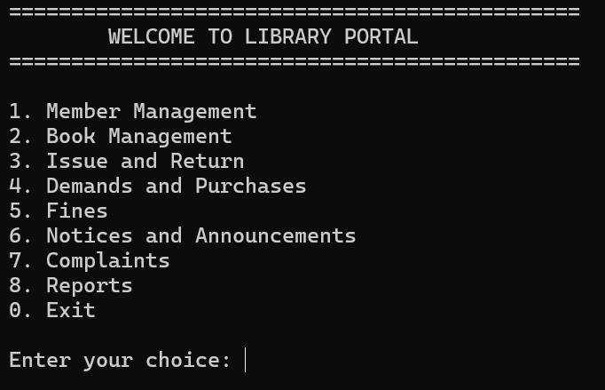
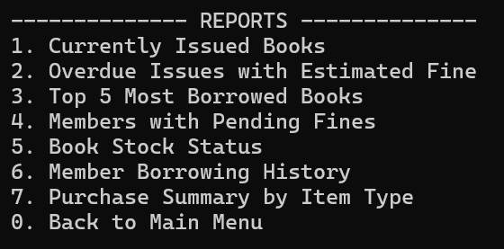
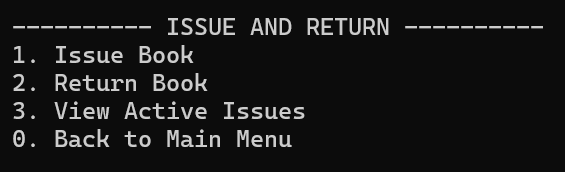
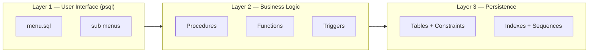

# 📚 EduVault — PostgreSQL Based Library Management System
### Overview

EduVault is a menu-driven Library Management System built entirely using PostgreSQL and operated through the psql CLI, without relying on a separate backend framework or web application.

The project demonstrates how database systems can function as complete application layers by combining relational schema design, stored procedures, triggers, constraints, and interactive SQL scripting.

### 🚀 Project Highlights

- Built a complete Library Management System using **PostgreSQL only**
- Implemented **database-first architecture** without a backend framework
- Designed **stored procedures, triggers, and constraints** for business logic
- Created a **menu-driven CLI system using psql**
- Automated workflows like **fine calculation, stock updates, and issue validation**

## 💡 Why This Project?

Most CRUD projects rely heavily on backend frameworks.

EduVault explores a different approach by treating PostgreSQL as the primary application layer and implementing workflows directly inside the database using procedures, triggers, and constraints.

### Demo
<p align="center">
  
</p>

#### Main Menu
<p align="center">
  
</p>

#### Reports
<p align="center">
  
</p>

#### Issue
<p align="center">
  
</p>

### Problem Statement
---
Managing books, members, issue-return workflows, fines, and purchase requests manually becomes inefficient as libraries scale.

EduVault solves this problem through a PostgreSQL-driven management system where core business logic is implemented directly inside the database using stored procedures, triggers, and constraints.

---

## ✨ Features

### 👤 Member Management

* Register new members
* Deregister members with validation checks
* Search and view member details
* Manage membership status

### 📖 Book Management

* Add books to inventory
* Search and view books
* Track stock quantity
* Monitor book availability

### 🔄 Issue & Return Management

* Issue books with eligibility validation
* Return books seamlessly
* Automatic stock updates
* Prevent duplicate book issuance

### 💰 Fine Management

* Automatic overdue fine calculation
* Fine payment workflow
* Track pending fines

### 📦 Demand & Purchase System

* Raise acquisition demands
* Approve purchase requests
* Track purchases
* Automatic stock updates after purchase

### 📢 Notice Management

* Post library announcements
* Expiry-based notice handling
* Multiple notice categories

### 🛠 Complaint Handling

* Raise complaints
* Track complaint resolution
* Manage complaint lifecycle

### 📊 Reports & Analytics

* Issued books report
* Overdue books analysis
* Top borrowed books report
* Purchase summaries
* Pending fines report
* Stock availability insights


---

## 🛠 Tech Stack

| Technology         | Purpose                                  |
| ------------------ | ---------------------------------------- |
| **PostgreSQL**     | Database engine                          |
| **PL/pgSQL**       | Business logic implementation            |
| **psql CLI**       | Interactive command-line interface       |
| **SQL Triggers**   | Automation and event handling            |
| **SQL Procedures** | Workflow and business process management |

---
## 🏗️ System Architecture

EduVault follows a **database-first architecture**, where PostgreSQL serves as both the **data storage layer** and the **application logic layer**. Instead of relying on an external backend framework, the system implements business workflows directly using **PL/pgSQL procedures, triggers, constraints, and psql-based interactive menus**.

The architecture is divided into **three logical layers**:

### 1. Presentation Layer — psql CLI

The user interface is implemented using **menu-driven SQL scripts** inside the `psql` terminal.

This layer:

* Displays interactive menus
* Captures user input using `\prompt`
* Routes actions using `\if`, `\gset`, `\i`, and `\ir`
* Executes procedures and queries

Example components:

* `sql/menu.sql` → Main entry point
* `member_menu.sql` → Member operations
* `book_menu.sql` → Book operations
* `issue_menu.sql` → Issue & return workflow
* `reports_menu.sql` → Reporting system

### 2. Business Logic Layer — PL/pgSQL

The business layer is implemented entirely inside PostgreSQL using **stored procedures, functions, and triggers**.

Responsibilities include:

* Member registration & deregistration
* Book issue/return workflows
* Fine calculation (`₹2/day overdue`)
* Demand approval & purchase handling
* Complaint management
* Notice publishing

Triggers additionally automate:

* Member eligibility validation
* Book availability checks
* Stock synchronization
* Automatic overdue fine creation

### 3. Persistence Layer — Relational Database

The persistence layer consists of **normalized relational tables** with strict constraints to maintain data integrity.

Key features:

* Foreign key relationships
* CHECK constraints for controlled values
* Indexed issue tracking (`member_id`, `book_id`)
* Sequence-based issue IDs (`issue_seq`)
* Automated stock and fine management

The database schema includes entities such as:
`member`, `book`, `issue`, `fine`, `demands`, `purchases`, `notice`, and `complaint`.

### Architecture Flow

```text
User (Librarian/Admin)
        ↓
psql Menu Interface
        ↓
Stored Procedures / Functions / Triggers
        ↓
PostgreSQL Relational Database
```

### System Architecture Diagram



## ⚙️ Installation & Setup

NOTE - Make sure to run commands from the project root directory.
### Clone Repository

```bash
git clone https://github.com/yash2106-byte/EduVault.git
cd EduVault
```

### Create Database

```sql
CREATE DATABASE library_portal;
```

### Setup Project

```bash
psql -d library_portal -f setup.sql
```

### Run Application

```bash
psql -d library_portal -f sql/menu.sql
```

## 🔄 Example Workflow

1. **Register Member**
2. **Add Book**
3. **Issue Book**
4. **Return Book**
5. **Fine gets generated automatically (if overdue)**

---

## ⚠️ Known Limitations

* Some menu scripts contain **path dependencies**
* Complaint menu is still **under development**
* Trigger/procedure overlap may cause **double stock decrement** during issue flow
* Overdue automation can be improved further

---

## 🚀 Future Improvements

* Add **authentication & role-based access**
* Add **Docker support**
* Build an **analytics dashboard**
* Add **Email/SMS notifications**

---

## 📚 Learning Outcomes

This project helped in understanding:

* Database normalization
* Stored procedures
* Trigger-based automation
* Relational constraints
* Transaction handling
* Database-driven architecture

---

## 👨‍💻 Author

**Yash Raj**
Computer Science Undergraduate passionate about
Backend Engineering, Databases, and Distributed Systems.

📧 **Email:** [rajyash2510@gmail.com](mailto:rajyash2510@gmail.com)
<br>🌐 **Portfolio:** https://yashcode.me
<br>💻 **GitHub:** https://github.com/yash2106-byte


