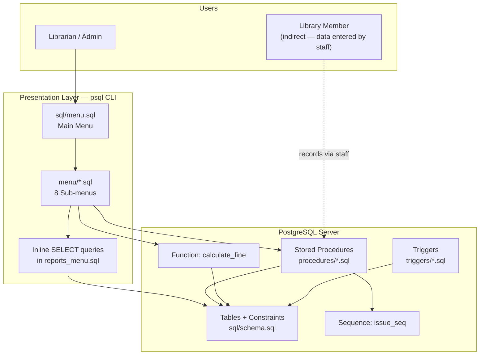

## System context diagram (detailed)

```mermaid
flowchart TB
    subgraph Users["Users"]
        LIB["Librarian / Admin"]
        MEM["Library Member<br/>(indirect — data entered by staff)"]
    end

    subgraph Client["Presentation Layer — psql CLI"]
        MAIN["sql/menu.sql<br/>Main Menu"]
        SUB["menu/*.sql<br/>8 Sub-menus"]
        RPT["Inline SELECT queries<br/>in reports_menu.sql"]
    end

    subgraph Server["PostgreSQL Server"]
        PROC["Stored Procedures<br/>procedures/*.sql"]
        FUNC["Function: calculate_fine"]
        TRG["Triggers<br/>triggers/*.sql"]
        TBL["Tables + Constraints<br/>sql/schema.sql"]
        SEQ["Sequence: issue_seq"]
    end

    LIB --> MAIN
    MEM -.->|"records via staff"| PROC
    MAIN --> SUB
    SUB --> PROC
    SUB --> FUNC
    SUB --> RPT
    RPT --> TBL
    PROC --> TBL
    FUNC --> TBL
    TRG --> TBL
    PROC --> SEQ
```

