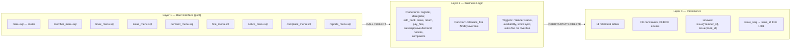

## Layered architecture (psql UI → DB logic → data)

```mermaid
flowchart LR
    subgraph L1["Layer 1 — User Interface (psql)"]
        direction TB
        M1["menu.sql — router"]
        M2["member_menu.sql"]
        M3["book_menu.sql"]
        M4["issue_menu.sql"]
        M5["demand_menu.sql"]
        M6["fine_menu.sql"]
        M7["notice_menu.sql"]
        M8["complaint_menu.sql"]
        M9["reports_menu.sql"]
    end

    subgraph L2["Layer 2 — Business Logic"]
        direction TB
        P1["Procedures: register, deregister,<br/>add_book, issue, return, pay_fine,<br/>raise/approve demand, notices,<br/>complaints"]
        P2["Function: calculate_fine<br/>₹2/day overdue"]
        P3["Triggers: member status,<br/>availability, stock sync,<br/>auto-fine on Overdue"]
    end

    subgraph L3["Layer 3 — Persistence"]
        direction TB
        D1["11 relational tables"]
        D2["FK constraints, CHECK enums"]
        D3["Indexes: issue(member_id), issue(book_id)"]
        D4["issue_seq → issue_id from 1001"]
    end

  L1 -->|"CALL / SELECT"| L2
  L2 -->|"INSERT/UPDATE/DELETE"| L3
```

