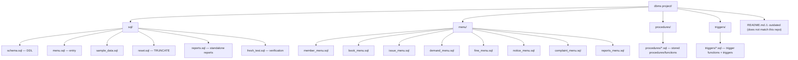

## Repository structure diagram

```mermaid
flowchart TB
    ROOT["dbms project/"]
    ROOT --> SQL["sql/"]
    ROOT --> MENU["menu/"]
    ROOT --> PROC["procedures/"]
    ROOT --> TRG["triggers/"]
    ROOT --> README["README.md ⚠ outdated (does not match this repo)"]

    SQL --> SCHEMA["schema.sql — DDL"]
    SQL --> MENUMAIN["menu.sql — entry"]
    SQL --> SAMPLE["sample_data.sql"]
    SQL --> RESET["reset.sql — TRUNCATE"]
    SQL --> REPORTS["reports.sql — standalone reports"]
    SQL --> FRESH["fresh_test.sql — verification"]

    MENU --> MM["member_menu.sql"]
    MENU --> BM["book_menu.sql"]
    MENU --> IM["issue_menu.sql"]
    MENU --> DM["demand_menu.sql"]
    MENU --> FM["fine_menu.sql"]
    MENU --> NM["notice_menu.sql"]
    MENU --> CM["complaint_menu.sql"]
    MENU --> RM["reports_menu.sql"]

    PROC --> PFILES["procedures/*.sql — stored procedures/functions"]
    TRG --> TFILES["triggers/*.sql — trigger functions + triggers"]
```

