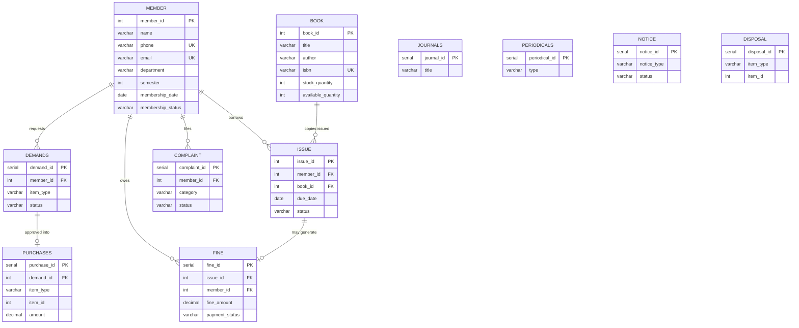

## ER diagram (database entities and relationships)

```mermaid
erDiagram
    MEMBER ||--o{ DEMANDS : "requests"
    MEMBER ||--o{ ISSUE : "borrows"
    MEMBER ||--o{ FINE : "owes"
    MEMBER ||--o{ COMPLAINT : "files"

    BOOK ||--o{ ISSUE : "copies issued"

    ISSUE ||--o| FINE : "may generate"

    DEMANDS ||--o| PURCHASES : "approved into"

    MEMBER {
        int member_id PK
        varchar name
        varchar phone UK
        varchar email UK
        varchar department
        int semester
        date membership_date
        varchar membership_status
    }

    BOOK {
        int book_id PK
        varchar title
        varchar author
        varchar isbn UK
        int stock_quantity
        int available_quantity
    }

    JOURNALS {
        serial journal_id PK
        varchar title
    }

    PERIODICALS {
        serial periodical_id PK
        varchar type
    }

    DEMANDS {
        serial demand_id PK
        int member_id FK
        varchar item_type
        varchar status
    }

    PURCHASES {
        serial purchase_id PK
        int demand_id FK
        varchar item_type
        int item_id
        decimal amount
    }

    ISSUE {
        int issue_id PK
        int member_id FK
        int book_id FK
        date due_date
        varchar status
    }

    FINE {
        serial fine_id PK
        int issue_id FK
        int member_id FK
        decimal fine_amount
        varchar payment_status
    }

    NOTICE {
        serial notice_id PK
        varchar notice_type
        varchar status
    }

    COMPLAINT {
        serial complaint_id PK
        int member_id FK
        varchar category
        varchar status
    }

    DISPOSAL {
        serial disposal_id PK
        varchar item_type
        int item_id
    }
```

