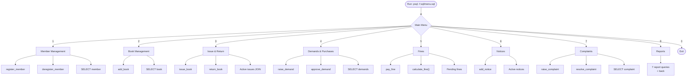

## Main menu → capabilities map

```mermaid
flowchart TD
    START(["Run: psql -f sql/menu.sql"])

    START --> MAIN{"Main Menu"}

    MAIN -->|1| M1["Member Management"]
    MAIN -->|2| M2["Book Management"]
    MAIN -->|3| M3["Issue & Return"]
    MAIN -->|4| M4["Demands & Purchases"]
    MAIN -->|5| M5["Fines"]
    MAIN -->|6| M6["Notices"]
    MAIN -->|7| M7["Complaints"]
    MAIN -->|8| M8["Reports"]
    MAIN -->|0| EXIT(["Exit"])

    M1 --> R1["register_member"]
    M1 --> D1["deregister_member"]
    M1 --> Q1["SELECT member"]

    M2 --> A2["add_book"]
    M2 --> Q2["SELECT book"]

    M3 --> I3["issue_book"]
    M3 --> R3["return_book"]
    M3 --> Q3["Active issues JOIN"]

    M4 --> RD["raise_demand"]
    M4 --> AD["approve_demand"]
    M4 --> Q4["SELECT demands"]

    M5 --> PF["pay_fine"]
    M5 --> CF["calculate_fine()"]
    M5 --> Q5["Pending fines"]

    M6 --> AN["add_notice"]
    M6 --> Q6["Active notices"]

    M7 --> RC["raise_complaint"]
    M7 --> RS["resolve_complaint"]
    M7 --> Q7["SELECT complaint"]

    M8 --> QR["7 report queries<br/>+ back"]
```

