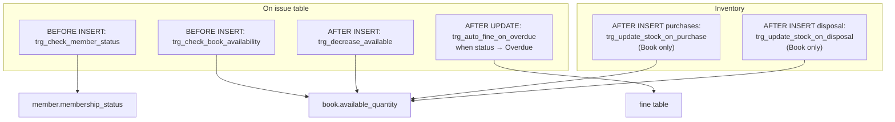

## Triggers overview (issue guards, stock, fines)

```mermaid
flowchart TB
    subgraph IssueTriggers["On issue table"]
        T1["BEFORE INSERT: trg_check_member_status"]
        T2["BEFORE INSERT: trg_check_book_availability"]
        T3["AFTER INSERT: trg_decrease_available"]
        T4["AFTER UPDATE: trg_auto_fine_on_overdue<br/>when status → Overdue"]
    end

    subgraph StockTriggers["Inventory"]
        T5["AFTER INSERT purchases:<br/>trg_update_stock_on_purchase<br/>(Book only)"]
        T6["AFTER INSERT disposal:<br/>trg_update_stock_on_disposal<br/>(Book only)"]
    end

    T1 --> MEM["member.membership_status"]
    T2 --> BOOK["book.available_quantity"]
    T3 --> BOOK
    T4 --> FINE["fine table"]
    T5 --> BOOK
    T6 --> BOOK
```

